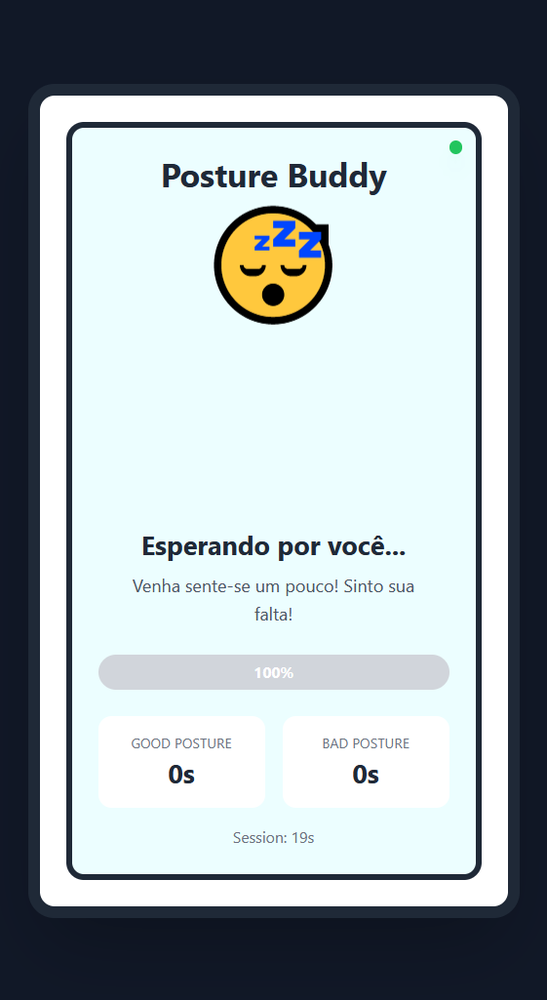
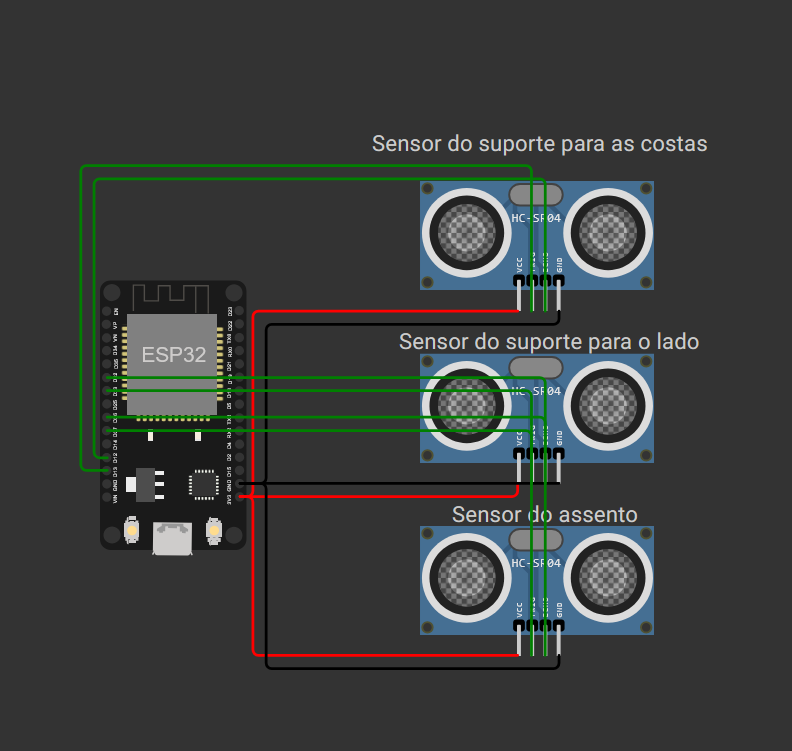
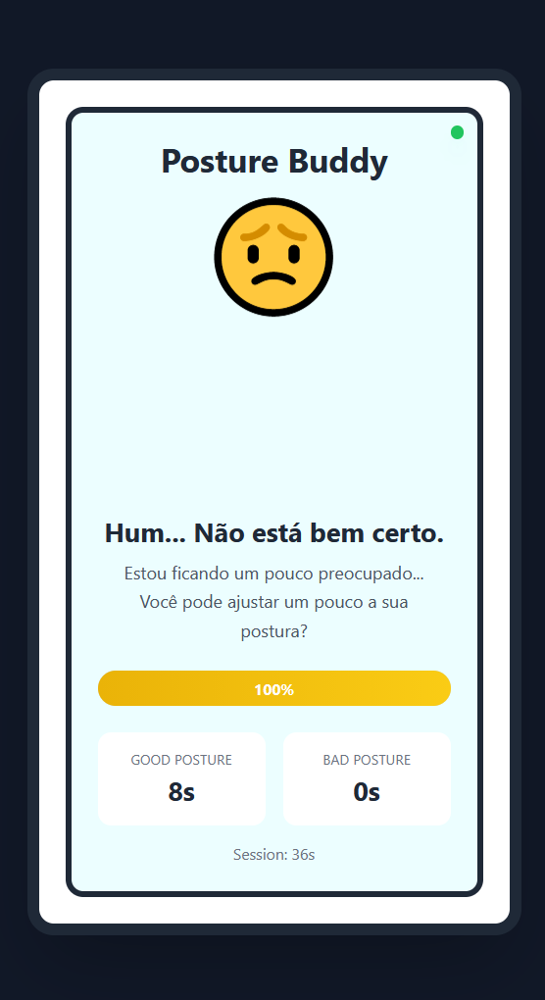
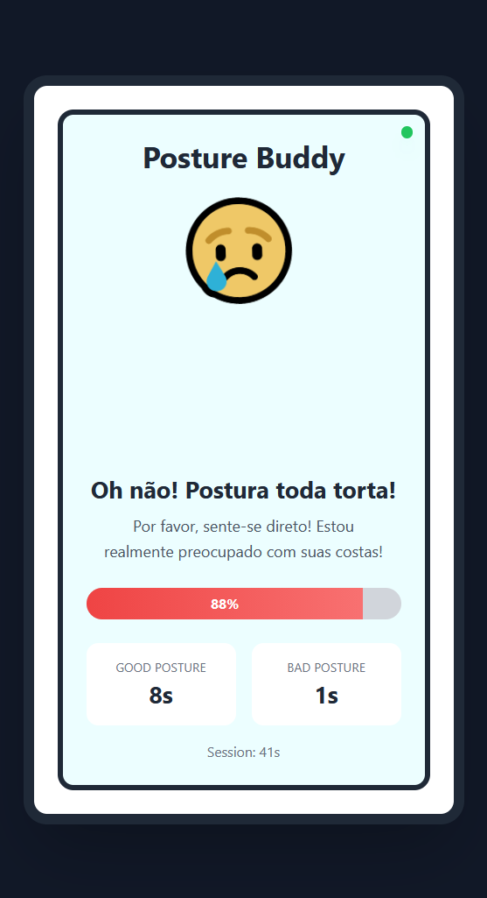
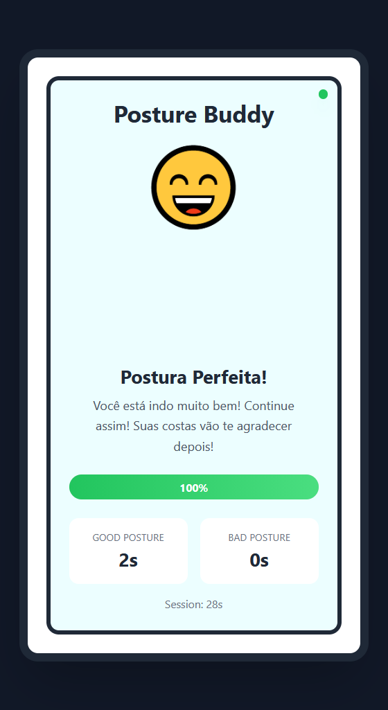

# 🪑 Posture Buddy - Monitor de Postura IoT

Um projeto IoT que monitora sua postura ao sentar usando sensores ultrassônicos e fornece feedback em tempo real através de um companheiro interativo estilo Tamagotchi!

<div align=center>
    
</div>

## 📋 Visão Geral

O Posture Buddy usa um microcontrolador ESP32 com três sensores ultrassônicos para monitorar:
- **Distância do suporte das costas** - Detecta se você está apoiando as costas corretamente
- **Detecção de inclinação lateral** - Monitora a postura lateral
- **Ocupação do assento** - Determina se alguém está sentado

Os dados são transmitidos via MQTT e exibidos em um dashboard web com um personagem animado que reage à sua postura em tempo real.

<div align=center>
    
</div>

## 🎯 Funcionalidades

- ✅ Monitoramento de postura em tempo real
- 📊 Rastreamento de estatísticas da sessão (tempo de boa vs. má postura)
- 🎮 Interface interativa estilo Tamagotchi
- 💯 Cálculo de pontuação de postura
- 🔄 Reconexão automática via WebSocket
- 🌟 Efeitos de partículas e animações
- 📱 Interface web responsiva

## 🛠️ Requisitos de Hardware

- **ESP32 DevKit V1**
- **3x Sensores Ultrassônicos HC-SR04**
- **Fios jumper**
- **Protoboard** (opcional)

### Diagrama de Conexão

**Sensor 1 (Suporte das Costas):**
- VCC → ESP32 3.3V
- GND → ESP32 GND
- TRIG → GPIO 13
- ECHO → GPIO 12

**Sensor 2 (Inclinação Lateral):**
- VCC → ESP32 3.3V
- GND → ESP32 GND
- TRIG → GPIO 27
- ECHO → GPIO 26

**Sensor 3 (Ocupação do Assento):**
- VCC → ESP32 3.3V
- GND → ESP32 GND
- TRIG → GPIO 33
- ECHO → GPIO 32

## 💻 Requisitos de Software

- **PlatformIO** (com extensão Wokwi para simulação)
- **Node.js** (v14 ou superior)
- **npm** ou **yarn**

## 📦 Instalação

### 1. Clone o Repositório

```bash
git clone <url-do-seu-repositorio>
cd posture-buddy
```

### 2. Configuração do ESP32

```bash
# Instalar dependências do PlatformIO (feito automaticamente)
pio lib install
```

### 3. Configuração do Servidor Frontend

```bash
cd front/server
npm install
```

## 🚀 Executando o Projeto

### Passo 1: Iniciar o Broker MQTT

Certifique-se de que seu broker MQTT está rodando em `44.223.43.74:1883` ou atualize a configuração em:
- `src/main.cpp` (linha 9)
- `front/server/server.js` (linha 6)

### Passo 2: Upload do Código para o ESP32

Usando PlatformIO:
```bash
# Para hardware real
pio run -t upload

# Para simulação no Wokwi
# Abra o diagram.json no Wokwi e execute a simulação
```

### Passo 3: Iniciar o Servidor Web

```bash
cd front/server
node server.js
```

O servidor será iniciado em `http://localhost:3000`

### Passo 4: Abrir o Dashboard

Navegue até `http://localhost:3000` no seu navegador

## 🎨 Humores do Buddy

O Posture Buddy tem quatro humores diferentes baseados na sua postura:

| Humor | Emoji | Condição |
|------|-------|-----------|
| **Vazio** | 😴 | Ninguém sentado |
| **Bom** | 😄 | Postura perfeita! |
| **Alerta** | 😟 | Postura precisa de ajuste |
| **Ruim** | 😢 | Postura ruim detectada |

<div align=center>
    
    
    
</div>
## ⚙️ Configuração

### Limites de Postura (em `src/main.cpp`)

```cpp
const int BACK_GOOD_MIN = 5;      // Distância mínima das costas (cm)
const int BACK_GOOD_MAX = 15;     // Distância máxima das costas (cm)
const int SIDE_GOOD_MAX = 20;     // Inclinação lateral máxima (cm)
const int SEAT_OCCUPIED = 30;     // Limite de ocupação do assento (cm)
```

Ajuste esses valores baseado na configuração da sua cadeira e posicionamento dos sensores.

### Configuração do WiFi

Atualize as credenciais do WiFi em `src/main.cpp`:
```cpp
char SSID[] = "Seu_SSID_WiFi";
char PASSWORD[] = "Sua_Senha_WiFi";
```

### Configuração do MQTT

Atualize as configurações do MQTT se estiver usando um broker diferente:
```cpp
const char* mqtt_server = "seu.broker.mqtt";
const int mqtt_port = 1883;
const char* mqtt_topic = "/seu/topico/caminho";
```

## 📊 Formato dos Dados

Mensagens MQTT são publicadas no formato JSON:

```json
{
  "backDistance": 12.5,
  "sideDistance": 15.3,
  "seatDistance": 20.1,
  "postureStatus": "good",
  "goodTime": 120,
  "badTime": 30,
  "sessionTime": 150,
  "postureScore": 80
}
```

## 🐛 Resolução de Problemas

### ESP32 Não Conecta ao WiFi
- Verifique o SSID e a senha
- Confirme que a rede WiFi é 2.4GHz (ESP32 não suporta 5GHz)
- Certifique-se de que a rede está acessível

### Falha na Conexão MQTT
- Verifique se o broker MQTT está rodando e acessível
- Confira as configurações de firewall
- Confirme o endereço IP e porta do broker

### WebSocket Não Conecta
- Certifique-se de que o servidor Node.js está rodando
- Verifique o console do navegador para erros
- Confirme que a porta 3000 não está bloqueada

### Problemas na Leitura dos Sensores
- Verifique todas as conexões dos fios
- Certifique-se de que os sensores têm alimentação adequada (3.3V)
- Verifique se as distâncias dos sensores estão dentro do alcance (2cm - 400cm)

## 🔧 Estrutura do Projeto

```
posture-buddy/
├── src/
│   └── main.cpp              # Firmware do ESP32
├── front/
│   ├── server/
│   │   ├── server.js         # Ponte WebSocket & MQTT
│   │   └── package.json
│   └── public/
│       ├── index.html        # Interface web
│       └── script.js         # Lógica do frontend
├── docs/
│   └── images/               # Imagens do README
├── diagram.json              # Diagrama de simulação Wokwi
├── platformio.ini            # Configuração do PlatformIO
└── README.md
```

## 🔗 Links Úteis

- 🎥 **Vídeo Demonstração**: [Assistir no YouTube](#)
- 🌐 **Simulação Wokwi**: [Abrir Projeto no Wokwi](https://wokwi.com/projects/446824854283655169)

## 🤝 Contribuindo

Contribuições são bem-vindas! Sinta-se à vontade para enviar um Pull Request.

## 📝 Licença

Este projeto é open source e está disponível sob a Licença MIT.

## 🙏 Agradecimentos

- Desenvolvido com [PlatformIO](https://platformio.org/)
- Simulado usando [Wokwi](https://wokwi.com/)
- Comunicação MQTT via [Paho MQTT](https://eclipse.org/paho/)
- Frontend desenvolvido com [Tailwind CSS](https://tailwindcss.com/)

## 📧 Contato

Para dúvidas ou suporte, por favor abra uma issue no GitHub.

---

**Boa postura! Deixe o Posture Buddy cuidar das suas costas! 🪑✨**

## 👥 Autores

- **Lucas Perez Bonato** - *565356* - [LucasBonato](https://github.com/LucasBonato)
- **Diogo Oliveira Lima** - *562559* - [oliveiralimadiogo](https://github.com/oliveiralimadiogo)
- **Lucas dos Reis Aquino** - *562414* - [LucassAquino](https://github.com/LucassAquino)